# 功能开发工作流技能

这套 Skill 帮助 Codex 围绕同一个 GitHub Issue 开发 Feature，并同步 GitHub Project 中的 Status：`feature-create` 用于创建并实现新 Feature，`feature-continue` 用于继续修改，`feature-done` 用于确认完成。

# 安装

首次使用前需要安装 `git` 和 GitHub 官方命令行工具 `gh`。先检查 `gh` 是否已安装：

```bash
gh --version
```

如果能看到版本号，可以跳过 `gh` 安装。否则请按 [GitHub CLI 官方安装说明](https://cli.github.com/) 安装。安装后登录 GitHub，并授予 Project 访问权限：

```bash
gh auth login
gh auth refresh -s project
```

获取本仓库并进入根目录：

```bash
gh repo clone itrufeng/codex-github-tracker
cd codex-github-tracker
```

然后选择一种方式安装本套件。

## 全局安装

安装后可以在所有项目中使用这三个 Skill：

```bash
./install.sh install --global
```

## 项目安装

只安装到指定的 Git repository：

```bash
./install.sh install --project /path/to/repository
```

把 `/path/to/repository` 替换为你的项目路径。

# 使用

使用前，请确保当前 Git repository 已关联一个由当前 GitHub 用户拥有且仍开放的 Project。Project 默认需要有名为 `Status` 的字段，以及 Ready、In progress、In review 和 Done 四个选项；名称不同时可按下方“常见问题”中的说明配置。

### `$feature-create` 用于提出并实现一个新 Feature。

假设你已经有一个 Todo List App，现在想让它在每天开始时，对昨天没完成的任务重新安排优先级。在 Codex 中输入：

```text
$feature-create 为 Todo List App 增加每日任务整理功能。每天第一次打开应用时，列出昨天未完成的任务，让用户通过拖拽重新安排它们的优先级，确认后保存新顺序。
```

这个Skill会让Github会自动跟踪到这个状态

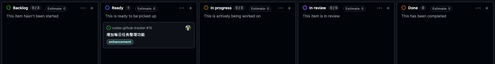

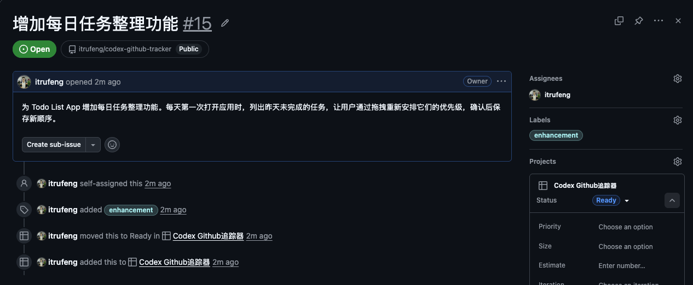

并且在开始实现的时候改变状态

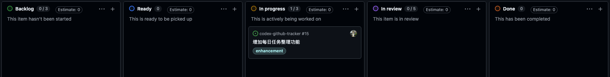

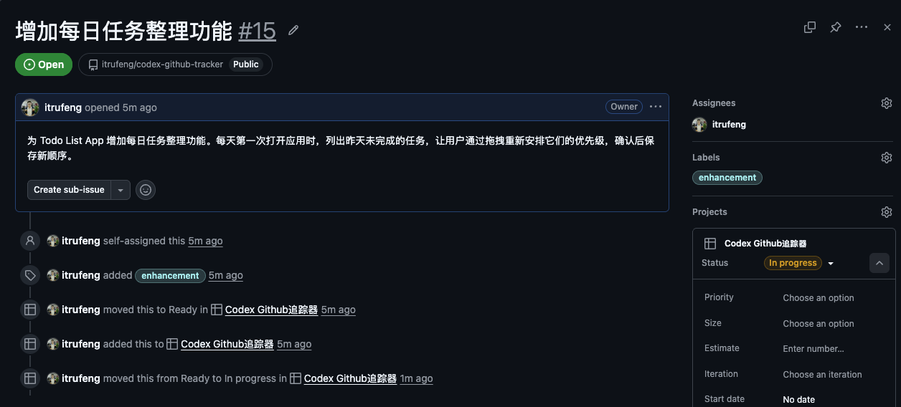

直到任务开发完成后

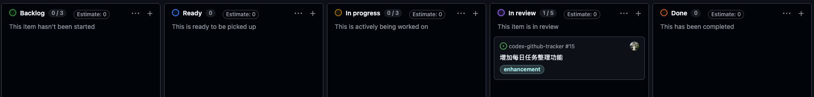

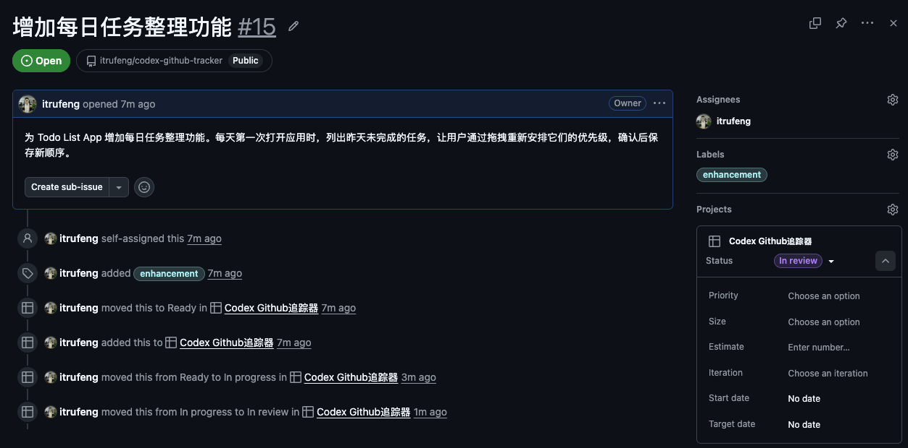

### `$feature-continue` 用于继续修改当前 Feature，可以多次使用，直到功能满意。

试用开发完毕的软件以后，你可能发现某些昨日任务已经不需要再做。这时不需要重新创建 Feature，而是继续打磨当前 Feature：

```text
$feature-continue 在重新安排昨日任务优先级时，为每个任务增加“放弃任务”选项。被放弃的任务不再进入今日列表，但仍保留在历史记录中。
```

这个Skill会让Github自动跟踪到这个状态

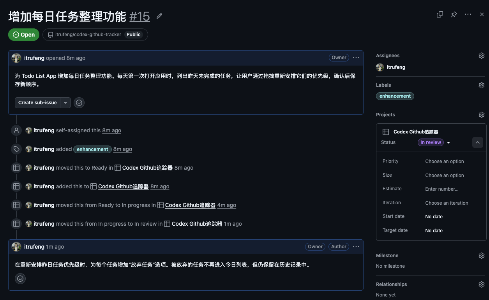

并且在开始实现的时候改变状态

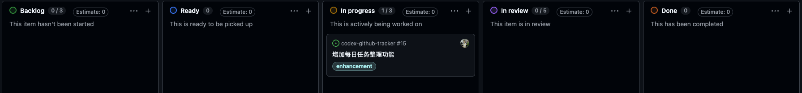

直到任务开发完成后

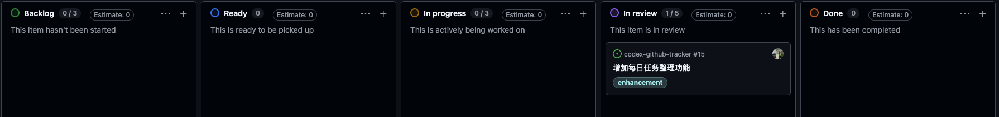

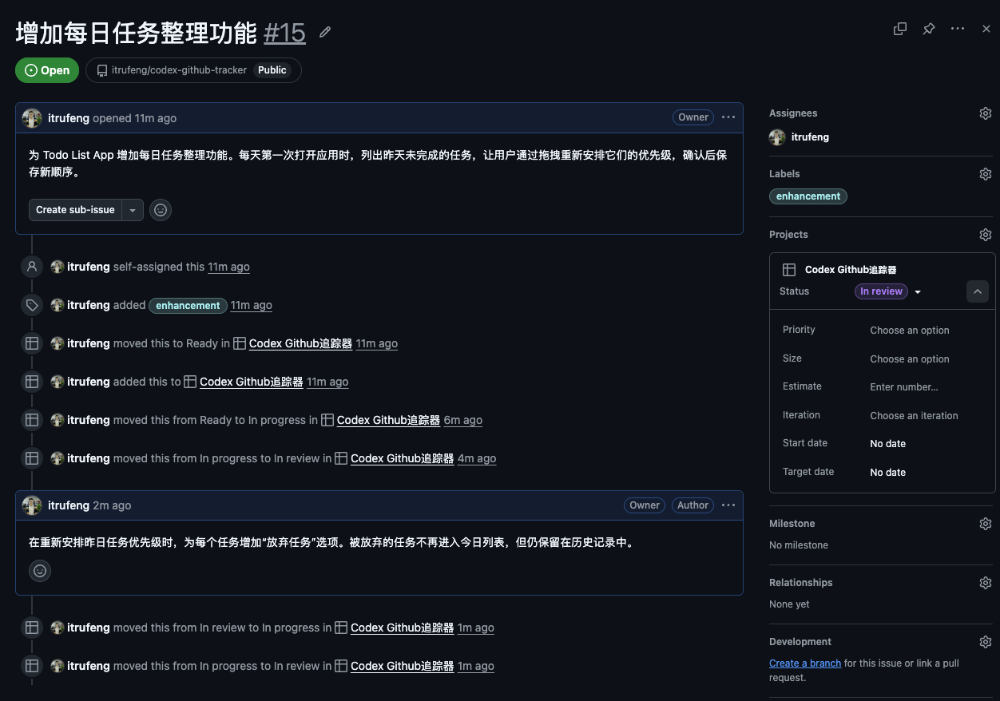

### `$feature-done` 用于确认当前 Feature 已完成并结束本次工作流。

经过试用功能后发现开发满足期望后，完成该功能开发：

```text
$feature-done
```

这个Skill会让Github自动跟踪到这个状态

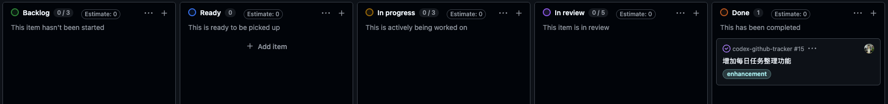

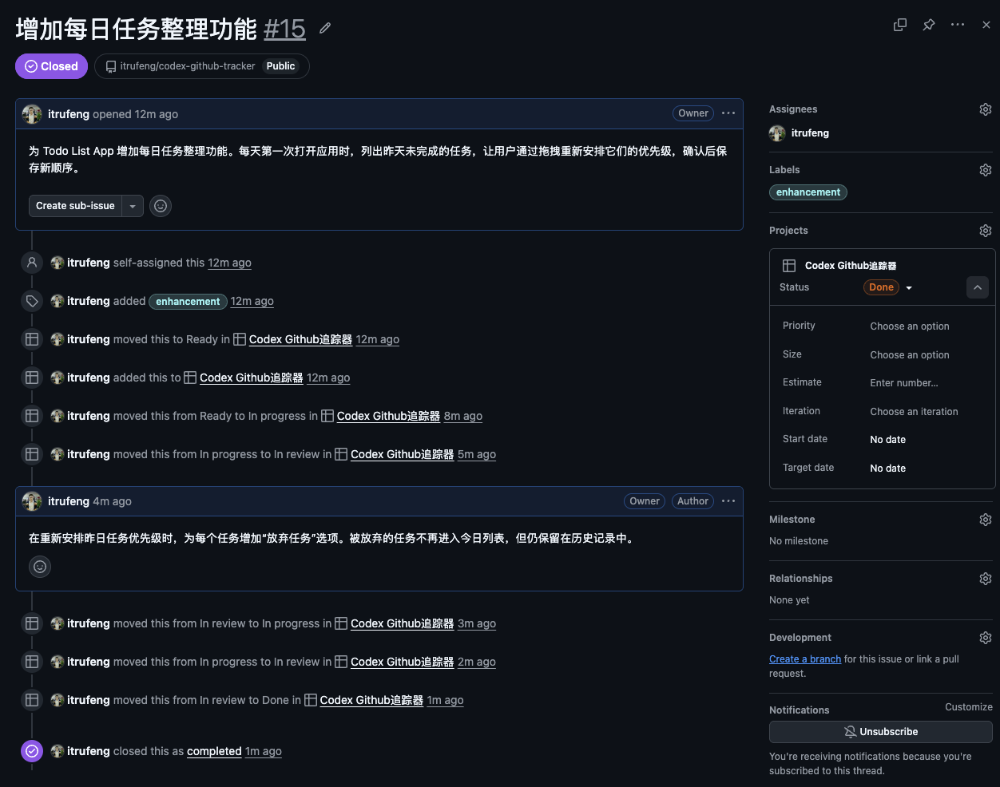


# 卸载

从全局 Codex 目录卸载：

```bash
./install.sh uninstall --global
```

如果还要删除仓库中的工作流配置和待处理状态，请为每个仓库添加一个 `--repo` 参数：

```bash
./install.sh uninstall --global \
  --repo /path/to/repository-one \
  --repo /path/to/repository-two
```

项目级卸载使用项目路径，同时删除该项目的工作流配置和待处理状态：

```bash
./install.sh uninstall --project /path/to/repository
```

# 常见问题

## Issue 会被加入哪个 Project？

工作流会在当前 repository 关联的 Project 中，选择由当前 `gh` 用户拥有且仍开放的 Project。如果只有一个符合条件的 Project，不需要额外配置。

## 一个 repository 关联了多个 Project 怎么办？

如果有多个符合条件的 Project，请在当前 repository 中创建 `.codex/feature-workflow.json`，用 `project_number` 指定 Issue 应加入的 Project：

```json
{
  "project_number": 123
}
```

该编号对应的 Project 必须已关联当前 repository，并且由当前 `gh` 用户拥有。

## 可以选择组织拥有的 Project 吗？

目前不支持，只能选择当前 `gh` 用户拥有的 Project。

## 我的 Project 使用了不同的 Status 名称怎么办？

默认使用 `Status` 字段中的 Ready、In progress、In review 和 Done。如果你的 Project 使用了其他名称，请在当前 repository 的 `.codex/feature-workflow.json` 中建立对应关系：

```json
{
  "status_field": "Workflow",
  "ready_status": "准备开发",
  "in_progress_status": "开发中",
  "in_review_status": "等待审核",
  "done_status": "已完成"
}
```

只需写入与默认值不同的配置。如果还需要选择 Project，可在同一文件中加入 `project_number`。完整示例见 `feature-workflow.example.json`。
